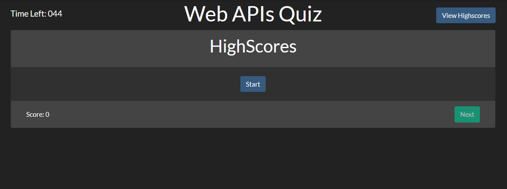

# BootCampQuiz
This is a simple quiz to test knowledge on WebAPIs
The base is extremely flexable with only needing to modify SampleQuiz.json to added, remove, or change questions. There is a built in highscore board that is store in localstorage on the quiz takers machine

